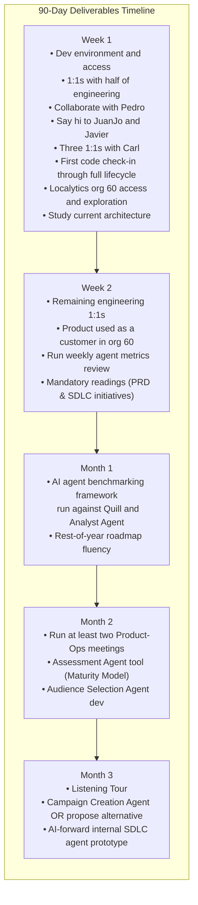

# **Yenifer Hernandez 90-Day Plan: Forward Deployed Engineer**

**Start Date:** Monday, September 21, 2026 | **Reports To:** Joey Rahman | **Onboarding Buddy:** Carl Jones

# **Welcome to the Team**

Yenifer, we are super excited to be working with you and can't wait to see what you accomplish. You are joining us at a pivotal moment, and your role here is critical to our success. We want you to feel fully supported and empowered from day one.

# **Who to Go to for What**

To make sure you never get stuck, here is your primary support network across the organization:

| **Focus Area** | **Primary Contact** | **Notes & Context** |
| :-: | :-: | :-: |
| Technical Questions | Carl Jones | Your onboarding buddy; go to him to get unblocked quickly. |
| Design & Architecture | Carl Jones | Consult for system design and code structure guidance. |
| Product, Agents & Roadmap | Juan Yrigoyen | Head of Product; lead for agent sequence and vision. |
| Customer Pods & Solutions | Derick | Guidance on customer integrations and Solutions workflows. |
| Data & ML Systems | Joey Rahman | Come directly to me for machine learning and data infrastructure. |
| Team & HR Matters | Joey Rahman | I will handle directly or route you to Sarah if needed. |

# **Core Operating Expectations**

To set you up for success, here are our core operating expectations and engineering values:

- **The Importance of Communication:** Bias towards over-communication at the start. Share your thinking and work early. Tag co-workers on Slack, and if you aren't getting responses, feel empowered to schedule time directly with them.
- **Work Hours:** We do not set strict hours for you. Figure out the necessary overlap with our globally distributed team (especially Pedro, who is in a different time zone) and set a schedule that works for you. Note that there might be times when engineers based in other time zones will need to shadow you and learn from you, so flexibility is required. This might occasionally require logging in early, around 8:00 AM Eastern Time.
- **Ownership & Accountability:** This is not a job where you just code, demo, and go home. You're smart. We expect you to proactively come up with initiatives and ideas, drive them forward, and take accountability for the outcomes. Learn from your setbacks. If something goes well, do the unfashionable thing and find where you got lucky.
- **Integrity:** Be reliable and deliver on your commitments. If you are at risk of slipping a commitment, say so early; surprise is the integrity failure, not the slip. This is the foundation for establishing deep trust and credibility within the engineering organization.

# **90-Day Objective & Deliverables Timeline**

By the end of 90 days, you will have shipped through the same engineering process everyone else uses, know the Localytics product as a user, stood up an AI agent benchmarking framework exercised against agents such as Quill and the Analyst Agent, and be current on the product and engineering roadmap for the rest of the year.

Month 2 and Month 3 technical deliverables are still being decided. What is already locked: by the end of Month 2, you will have **run at least two Product-Ops meetings**.

# **Week 1: Ship Something & Secure Access**

# **Goal**

Become familiar with the complete engineering workflow by taking a small code change all the way through the development and deployment process, and ensure you have all the access and permissions needed to operate independently.

# **Activities**

- **Environment & Access:** Complete development environment and repository setup. Verify and secure all necessary access and permissions across our tools, environments, and repos.
- **Product Exploration:** Get access to **Localytics org 60** and spend real time in it. Click around. Create things. Leave Week 1 having used the product as a customer would, not only having read about it.
- **Architecture & Team:** Study the current Localytics architecture. Meet half of the engineering team in 1:1s.
- **Collaborate with Pedro:** Use this time to get introduced to the sustainable work currently in flight for the Analyst Agent and familiarize yourself with the pipeline.
- **Peer Onboarding:** Say hi to your fellow new hires, JuanJo and Javier. You three are the new-kid cluster. Compare notes on where the coffee (metaphorical) is. This is a real Week 1 deliverable.
- **Deep Dive with Carl:** Have three 1:1s with Carl. In these sessions, have him walk you through the codebase and the agent surface so you leave Week 1 knowing where the product, agents, and related code live.
- **First Code Ship:** Ask Pedro for a very simple bug or task to ship, and make your first code check-in during Week 1. Follow the standard lifecycle:
  1. Branch / code
  2. Pull request
  3. Code review
  4. CI/CD pipeline
  5. Deployment
  6. Production verification
  7. Merge to main
- **Release Process:** Understand how releases currently move from development through sandbox and into production environments.

# **Success Criteria**

By the end of Week 1, you have shipped code through the same process that feature engineers use, you understand at a practical level **how code gets to production**, you have all required access permissions, and you have spent meaningful hands-on time in **org 60**.

# **Week 2: Meet the Rest of Engineering**

# **Goal**

Finish meeting the engineering team and keep using the product so Month 1 work is grounded in how Localytics actually behaves.

# **Activities**

- **Engineering 1:1s:** Meet the remaining half of the engineering team in 1:1 sessions.
- **Customer Simulation:** Continue using **org 60** as a real user and studying the product architecture deeply. Reproduce important customer workflows hands-on, including how marketers run campaigns and how agents such as Quill and the Analyst Agent show up in the product.
- **API & Interface Surface:** Review public APIs, MCP surfaces, and how customers currently reach Quill.
- **Operational Meetings:** Run the weekly agent metrics review meeting.
- **Mandatory Reading:**
  - Read the **Agent Evaluation Framework PRD** (in our PRDs repo) so Week 3 starts with a shared picture of the benchmarking work.
  - Read up on the Agentic SDLC initiatives in flight for this quarter: **2026 Q3 Agentic SDLC Initiatives**.

## **Two-Week Deliverable**

You have met the full engineering team, you can navigate org 60 without guidance, and you can describe in your own words what Quill and the Analyst Agent do for a customer.

# **Month 1: AI Agent Benchmarking Framework**

# **Objective**

Stand up an **AI agent benchmarking framework** and actually run it against our AI agents, starting with **Quill** and the **Analyst Agent**. By the end of the month you should also be able to speak fluently about the **roadmap for the rest of the year**.

Note: This month is not a paper design. The framework has to be tested against real production agents.

# **Roadmap Fluency**

During Month 1, get yourself current on what we are building for the rest of the year:

- Meet with **Juan (Head of Product)** on the product roadmap and the agent sequence.  
- Sit in **grooming** and read the PRDs for work already on the board before those meetings.  
- Leave Month 1 able to answer, without notes: what is in flight, and what is coming next.

# **Benchmarking Framework**

Build a shared evaluation system that can be pointed at more than one agent. You will fully own this benchmarking initiative initially. Quill and the Analyst Agent are the first two it must run against. They are different kinds of agents, so the framework has to support more than one way of scoring:

The framework should enable someone on this team to answer: which model should power this agent, at what quality, cost, and latency, backed by a stored run as evidence rather than intuition.

**Minimum Bar for Month 1 Deliverable:**

- One runner that sends identical benchmark items to every contender model.
- Quality metrics joined with **cost, latency, and (where relevant) step count**.
- A real benchmark run against **Quill**.
- A real benchmark run against the **Analyst Agent** (coordinate instrumentation with Pedro).
- A concise readout detailing run results and planned iteration.

*Guidance:* Use the existing **Agent Evaluation Framework PRD** as the baseline. Do not rebuild a parallel philosophy. If the PRD is wrong or too heavy for a 30-day slice, highlight it in the readout and ship a lean version that runs against both agents.

# **Month 1 Flagship Deliverable**

Demo the working framework to all of engineering (including Carl, Juan, and Joey):

1. How a benchmark is authored and executed.
2. Live results of the Quill and Analyst Agent runs.
3. Practical decision-making workflow for evaluating models.
4. Your synthesis of the rest-of-year roadmap and proposed adjustments.

# **Month 1 Success Criteria**

1. You have shipped to production at least once through the standard engineering lifecycle.
2. You have used org 60 enough to talk about the product as an active practitioner.
3. The benchmarking framework has been **tested against Quill and the Analyst Agent**, not merely documented.
4. You can fluently discuss the rest-of-year roadmap without relying on meeting prep.

# **Month 2: Product-Ops & Assessment Agent Tool**

# **Objective**

Month 2 technical deliverables focus on launching your first product agent integration and building a diagnostic agent that powers our Solutions team. The locked operational commitment is **Product-Ops**.

# **Product-Ops**

We are standing up engineer-driven Product-Ops. This bi-weekly meeting examines:

- **Product usage:** who is using which features (campaigns, workflows, analytics).
- **Operations:** campaigns created, scheduled campaigns executed, message delivery volumes, and failures.

Engineering generates these metrics and leads the bi-weekly review. Other engineers will rotate ownership over time; in Month 2, you run it.

**Requirement:** By the end of Month 2, you will have run at least **two Product-Ops meetings** (pulling numbers, presenting to the room, and driving the discussion). 

# **Assessment Agent (Maturity Model)**

Our Solutions team uses a 140+ question Lifecycle Marketing Maturity Model to score clients and propose AI-enablement engagements. Today, this is a manual consulting process. 

- **Build an Assessment Agent** that ingests diverse raw customer artifacts (campaign spreadsheets, past reports, granola transcripts, our own warehouse) and automatically scores the customer on our 0–4 grid across 7 capabilities.
- **Evidence Map Output:** The agent must output specific quotes or missing data justifying each score, rather than a black-box rating.
- **Proposal Drafts:** Auto-generate the first draft of the proposal text based on the customer's business archetype. Work directly with Juan, Derick, and Jase as your primary internal customers.
- *Open Question:* Who writes the PRD? As of now, a formal PRD does not exist. You may need to author the PRD yourself.

# **Audience Selection Agent (Product)**

Kick off development on the Audience Selection Agent. A marketer describes an audience segment in plain English, and the agent translates it into concrete selection criteria and estimated audience size, awaiting human confirmation before saving. 

- Use the **Benchmarking Framework** built in Month 1 to evaluate model candidates, cost tradeoffs, and latency requirements for this agent.

# **Month 3: Customer Workflow Integration & Exploration**

# **Objective**

Take your agent expertise directly into the customer's operational workflow—the core mandate of a Forward Deployed Engineer.

# **The Listening Tour**

Accompany Juan on our customer listening tour starting this month. This is a critical audit of real customer workflows and operational pain points.

- Approach sessions with an open mind, avoiding predefined assumptions.
- Absorb transcripts, extract behavioral patterns, and map customer problems to the agent capabilities evaluated in Month 2.

# **Field Integration (Embrace Ambiguity)**

As a senior engineer, you are expected to navigate ambiguity and help shape what we build.

- **Default Path — Campaign Creation Agent:** Customers like QVC currently plan campaigns in Airtable, then manually re-key everything into Localytics. Build and deploy a Campaign Creation Agent that pulls directly from the customer's source of truth (e.g., Airtable) and drafts campaigns automatically in Localytics.
- **Alternative Path — Propose a Better Solution:** Based on insights from the Assessment Agent data and Listening Tour, you have leeway to propose an alternative high-value solution. If you identify a more critical workflow gap across our customer base, pitch it with a clear defense of tradeoffs, feasibility, and business value.

# **AI-Forward Engineering (Internal SDLC Agent)**

By the end of the third month, identify and prototype **one meaningful use of an AI agent within our internal engineering lifecycle (SDLC)**. 

*Core Principle:* The requirement is **not** simply to "build an AI agent." Instead: **Identify an expensive, manual, or ineffective engineering/SDLC problem, define a measurable outcome, and determine whether an agentic workflow is an effective solution.**

Proposals must anchor on a non-AI success metric, for example:

- *Problem:* Engineers spend 3 hours a week manually maintaining integration test setups for new agents.
- *Success Metric:* Reduce setup time to 0 hours via automated test scaffolding.

Whether the solution relies on LLMs, deterministic automation, or a hybrid approach is secondary; engineering impact is the primary goal.

# **Day-90 Definition of Success**

At the end of 90 days, you should be able to demonstrate:

1.  **Process Fluency:** You ship code through the standard pipeline independently and know how changes move to production.
2.  **Product Fluency:** You are fluent in org 60 and core customer workflows, including how Quill and the Analyst Agent (once Pedro finishes the initial build) operate in production.
3.  **Agent Evaluation:** An operational AI agent benchmarking framework exists and has generated empirical benchmark runs for Quill and the Analyst Agent.
4.  **Roadmap Awareness:** You understand our rest-of-year product and engineering commitments and how your work integrates into them.
5.  **Operational Ownership:** You have led at least two Product-Ops meetings with clear, visible telemetry and operational metrics.
6.  **Assessment Agent:** You have shipped a functional diagnostic agent that the Solutions team uses to score clients and generate evidence-backed proposals.
7.  **Customer Integration:** You have built and deployed a field agent (Campaign Creation or an approved alternative) that saves real customers time in their daily operations.
8.  **Internal AI Adoption:** You have prototyped a targeted internal SDLC improvement backed by a clear, non-AI outcome metric.

